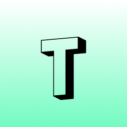

<p align="center">
  
  <h1 align="center">ThemeAI</h1>
  <p align="center">AI-Powered Web Design Themes</p>
</p>
<p align="center">
  <a href="https://github.com/AshishBarvaliya/themeai/blob/main/LICENSE">
    
  </a>
</p>

# 🌈 Welcome to ThemeAI: Elevate Your Web Design with AI-Powered Themes! 🚀

**ThemeAI** is your gateway to transforming websites into purposeful masterpieces. Harness the power of GPT-4 to generate, curate, and customize stunning themes effortlessly. Whether you're a developer, designer, or enthusiast, ThemeAI offers a seamless experience to craft visually captivating designs without coding. Explore, create, and share your unique style with the world!


## ✨ Features

- **AI-Curated Themes**: Dive into a vast library of themes generated by advanced AI, tailored to your project's needs.
- **Profile Management**: Save, like, and organize your favorite themes. Connect with a community of creators.
- **Manual Theme Creation**: Design themes from scratch, preview with demo templates, and save your creations.
- **AI Theme Generation**: Convert project details into vibrant themes with purposeful colors in seconds.
- **Theme Viewing & Export**: Explore theme details (likes, saves, views) and export designs seamlessly.


## 🛠️ Technology Stack  

- **Frontend**: Next.js, TypeScript, Tailwind CSS, ShadcnUI, RadixUI  
- **Database**: PostgreSQL, Drizzle ORM  
- **Testing**: Jest, React Testing Library  
- **Tools**: Next-Auth, Stripe, Nodemailer, Google Analytics, GPT-4, Vercel  


## 🖼️ Screenshots

<p align="center">
    <figure>
     <figcaption align="center">
        <b>Browse Themes</b>
      </figcaption>
      
    </figure>
    <figure>
     <figcaption align="center">
        <b>Prompt your Idea</b>
      </figcaption>
      
    </figure>
    <figure>
     <figcaption align="center">
        <b>View Theme</b>
      </figcaption>
      
    </figure>
</p>


## Getting Started

Follow these instructions to set up a local development environment. Make sure you have Node.js (latest LTS version) and a Firebase account before you start.

### Installation

1. **Clone the repository:**

```bash
git clone https://github.com/AshishBarvaliya/ThemeAI.git
```

2. **Navigate to the project directory:**

```bash
cd ThemeAI
```

3. **Install dependencies:**

```bash
npm install
```

4.  **Set up Development Environment :**

- Create a `.env` file in the root of your project.
- Add your project configuration to `.env`. For example:

```markdown
OPENAI_API_KEY=xx
DRIZZLE_DATABASE_URL=xx

NEXTAUTH_SECRET=xx
NEXTAUTH_URL="http://localhost:3000"

GOOGLE_CLIENT_ID=xx
GOOGLE_CLIENT_SECRET=xx

NODE_ENV="development"

STRIPE_PRICE_ID=xx
STRIPE_SECRET_KEY=xx

PUPU_PER_PURCHASE=30
VERIFICATION_MAIL_LIMIT=20
FORGOT_PASSWORD_MAIL_LIMIT=30
EMAIL_LINK_EXPIRY=60    # minutes

THEMES_PER_PAGE=12

MAIL_SMTP_HOST="smtpout.secureserver.net"
MAIL_SMTP_POST=465
MAIL_SMTP_USER=xx
MAIL_SMTP_PASS=xx

THEMEAI_ACCOUNT_ID=xx

NEXT_PUBLIC_TRACKING_ID=xx

```

5.  **Run the development server:**

```bash
npm run dev
```

Navigate to `http://localhost:3000` to view your project running locally.

### Contribution

Feel free to contribute to the project by submitting pull requests or opening issues for any bugs or feature requests. Your feedback and contributions are highly appreciated!
